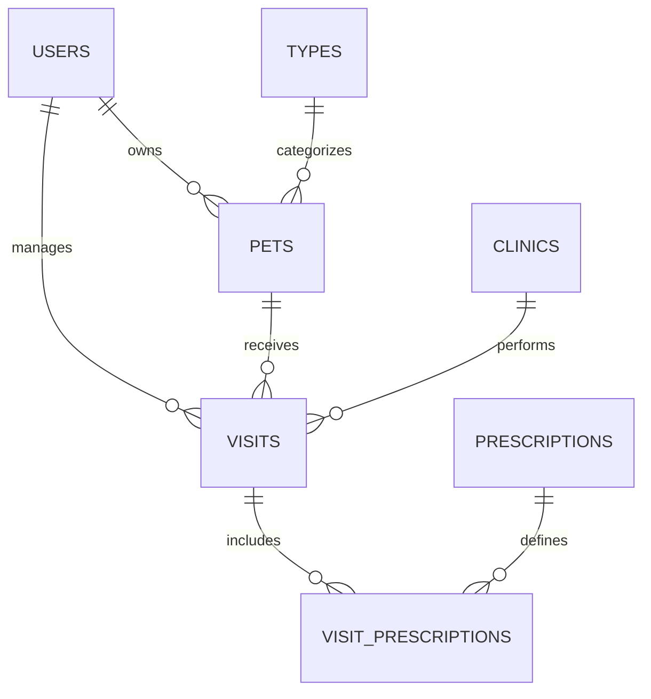

# Pet Management API (Based on Spring PetClinic REST)

This backend application provides a REST API for managing a veterinary clinic system, including **Users, Pets, Clinics, Visits, Prescriptions, and Inventory Items**.

## Understanding the Pet Management application with a few diagrams

### PetcManagement ER Model



## Running Petclinic locally

### With Maven command line
```sh
git clone https://github.com/takuto-san/pet-management-api
cd pet-management-api
./mvnw spring-boot:run
```

You can then access petclinic here: [http://localhost:9966/petmanagement/api](http://localhost:9966/petmanagement/api)

There is an actuator health check route as well:
* [http://localhost:9966/petmanagement/api/actuator/health](http://localhost:9966/petmanagement/api/actuator/health)

## 📖 OpenAPI REST API Documentation
managing a veterinary clinic's users, pets, clinics, visits, prescriptions, and inventory items.

### **Access Swagger UI**
Swagger UI is available at: [http://localhost:9966/petmanagement/api/swagger-ui/index.html](http://localhost:9966/petmanagement/api/swagger-ui/index.html).

API documentation (OAS 3.1) is accessible at: [http://localhost:9966/petmanagement/api/v3/api-docs](http://localhost:9966/petmanagement/api/v3/api-docs).


## 📌 API Endpoints Overview

| **Method** | **Endpoint** | **Description** |
|-----------|------------|----------------|
| **Users** |  |  |
| **GET** | `/api/users` | List users (supports kana search) |
| **POST** | `/api/users` | Create a new user |
| **GET** | `/api/users/{userId}` | Get a user by ID |
| **PUT** | `/api/users/{userId}` | Update user details |
| **DELETE** | `/api/users/{userId}` | Delete a user |
| **Pets** |  |  |
| **GET** | `/api/pets` | Retrieve all pets |
| **POST** | `/api/pets` | Add a new pet |
| **GET** | `/api/pets/{petId}` | Get a pet by ID |
| **PUT** | `/api/pets/{petId}` | Update pet details |
| **DELETE** | `/api/pets/{petId}` | Delete a pet |
| **Pet Types** |  |  |
| **GET** | `/api/pettypes` | Retrieve all pet types |
| **POST** | `/api/pettypes` | Add a new pet type |
| **Clinics** |  |  |
| **GET** | `/api/clinics` | List all clinics |
| **POST** | `/api/clinics` | Add a new clinic |
| **GET** | `/api/clinics/{clinicId}` | Get a clinic by ID |
| **PUT** | `/api/clinics/{clinicId}` | Update clinic details |
| **DELETE** | `/api/clinics/{clinicId}` | Delete a clinic |
| **Visits** |  |  |
| **GET** | `/api/visits` | List visits (filter by petId) |
| **POST** | `/api/visits` | Record a new visit |
| **GET** | `/api/visits/{visitId}` | Get a visit by ID |
| **PUT** | `/api/visits/{visitId}` | Update a visit |
| **DELETE** | `/api/visits/{visitId}` | Delete a visit |
| **Visit Prescriptions** |  |  |
| **GET** | `/api/visits/{visitId}/prescriptions` | List prescriptions for a visit |
| **POST** | `/api/visits/{visitId}/prescriptions` | Add a prescription to a visit |
| **DELETE** | `/api/visits/{visitId}/prescriptions/{visitPrescriptionId}` | Remove a prescription from a visit |
| **Master Data** |  |  |
| **GET** | `/api/prescriptions` | List prescription master data |
| **POST** | `/api/prescriptions` | Add new prescription master data |
| **GET** | `/api/items` | List item master data |
| **POST** | `/api/items` | Add new item master data |
| **System** |  |  |
| **GET** | `/api/oops` | Always fails (for testing errors) |


## Database Settings

### **Using PostgreSQL**

Start a PostgreSQL database using Docker:
```bash
docker run -e POSTGRES_USER=petmanagement -e POSTGRES_PASSWORD=petmanagement -e POSTGRES_DB=petmanagement -p 5432:5432 postgres:17
```

Instead of manually running containers, you can also use `docker-compose.yml`:

```sh
docker-compose --profile postgres up
```

## API First Approach

This API is built following some [API First approach principles](https://swagger.io/resources/articles/adopting-an-api-first-approach/).

It is specified through the [OpenAPI](https://oai.github.io/Documentation/).
It is specified in this [file](./src/main/resources/openapi.yml).

Some of the required classes are generated during the build time. 
Here are the generated file types:
* DTOs
* API template interfaces specifying methods to override in the controllers

To see how to get them generated you can read the next chapter. 

## Generated code

Some of the required classes are generated during the build time using maven or any IDE (e.g., IntelliJ Idea or Eclipse).

All of these classes are generated into the ``target/generated-sources`` folder.

Here is a list of the generated packages and the corresponding tooling:

| Package name                                   | Tool             |
|------------------------------------------------|------------------|
| org.springframework.petmanagement.mapper   | [MapStruct](https://mapstruct.org/)        |
| org.springframework.petmanagement.rest.dto | [OpenAPI Generator maven plugin](https://github.com/OpenAPITools/openapi-generator/) |


To get both, you have to run the following command:

```jshelllanguage
mvn clean install
```

## Security configuration
In its default configuration, Petclinic doesn't have authentication and authorization enabled.

### Basic Authentication
In order to use the basic authentication functionality, turn in on from the `application.properties` file
```properties
petclinic.security.enable=true
```

## Looking for something in particular?

| Layer | Source |
|--|--|
| REST API controllers | [REST folder](src/main/java/org/springframework/petmanagement/rest) |
| Service | [ManagementServiceImpl.java](src/main/java/org/springframework/petmanagement/service/ManagementServiceImpl.java) |
| JDBC | [jdbc folder](src/main/java/org/springframework/petmanagement/repository/jdbc) |
| JPA | [jpa folder](src/main/java/org/springframework/petmanagement/repository/jpa) |
| Spring Data JPA | [springdatajpa folder](src/main/java/org/springframework/petmanagement/repository/springdatajpa) |
| Tests | [AbstractPetManagementServiceTests.java](src/test/java/org/springframework/petmanagement/service/managementService/AbstractPetManagementServiceTests.java) |

## 🧪 Testing

*Currently, the automated tests (JMeter/Postman) are under construction to match the new database schema.*

# Contributing

This project is a custom extension of the Spring Petclinic.
If you find a bug, please report it to the repository owner.