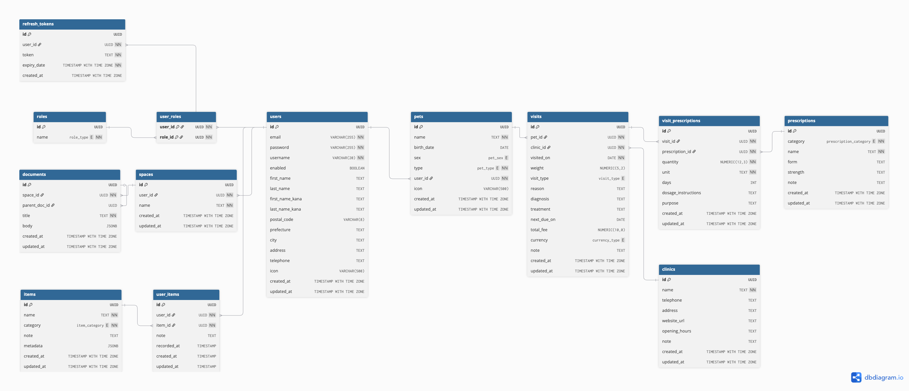

# Pet Management API (Based on Spring PetClinic REST)

This backend application provides a REST API for managing a veterinary clinic system, including **Users, Pets, Clinics, Visits, Prescriptions, and Inventory Items**.

## Understanding the Pet Management application with a few diagrams

### PetManagement ER Model



## Running Petclinic locally

### With Maven command line
```sh
git clone https://github.com/takuto-san/pet-management-api
cd pet-management-api
./mvnw spring-boot:run
```

You can then access petclinic here: [http://localhost:9966/petmanagement/api/v2](http://localhost:9966/petmanagement/api/v2)

There is an actuator health check route as well:
* [http://localhost:9966/petmanagement/api/v2/actuator/health](http://localhost:9966/petmanagement/api/v2/actuator/health)

## 📖 OpenAPI REST API Documentation
managing a veterinary clinic's users, pets, clinics, visits, prescriptions, and inventory items.

### **Access Swagger UI**
Swagger UI is available at: [http://localhost:9966/petmanagement/api/v2/swagger-ui/index.html](http://localhost:9966/petmanagement/api/v2/swagger-ui/index.html).

API documentation (OAS 3.1) is accessible at: [http://localhost:9966/petmanagement/api/v2/docs](http://localhost:9966/petmanagement/api/v2/docs).


## 📌 API Endpoints Overview

| **Tag** | **Method** | **Endpoint** | **Description** |
| :--- | :--- | :--- | :--- |
| **Authentication** |
| |**POST** | `/auth/signin` | Sign in with email and password (returns JWT & refresh token) |
| | **POST** | `/auth/signup` | Register a new user (**Public**) |
| | **GET** | `/auth/me` | Get current user details (Token validation / Login check) |
| | **POST** | `/auth/refreshtoken` | Generate a new access token using a refresh token |
| | **POST** | `/auth/signout` | Log out user |
| **Users** |
| | **GET** | `/users` | List users with pagination (supports kana search) |
| | **POST** | `/users` | Create a user (**Admin Only**) |
| | **GET** | `/users/{userId}` | Get a user by ID (UUID) |
| | **PUT** | `/users/{userId}` | Update user profile |
| | **DELETE** | `/users/{userId}` | Delete a user |
| **Pets** |
| | **GET** | `/pets` | List all pets with pagination |
| | **POST** | `/pets` | Add a new pet |
| | **GET** | `/pets/{petId}` | Get a pet by ID |
| | **PUT** | `/pets/{petId}` | Update pet details |
| | **DELETE** | `/pets/{petId}` | Delete a pet |
| **Pet Types** |
| | **GET** | `/pettypes` | Get allowed pet types (Enum values) |
| **Clinics** |
| | **GET** | `/clinics` | List all clinics with pagination |
| | **POST** | `/clinics` | Add a new clinic |
| | **GET** | `/clinics/{clinicId}` | Get a clinic by ID |
| | **PUT** | `/clinics/{clinicId}` | Update clinic details |
| | **DELETE** | `/clinics/{clinicId}` | Delete a clinic |
| **Visits** |
| | **GET** | `/visits` | List visits with pagination (can filter by `petId`) |
| | **POST** | `/visits` | Record a new visit |
| | **GET** | `/visits/{visitId}` | Get a visit by ID |
| | **PUT** | `/visits/{visitId}` | Update a visit |
| | **DELETE** | `/visits/{visitId}` | Delete a visit |
| **Visit Prescriptions** |
| | **GET** | `/visits/{visitId}/prescriptions` | List prescriptions for a specific visit |
| | **POST** | `/visits/{visitId}/prescriptions` | Add a prescription to a visit |
| | **DELETE** | `/visits/{visitId}/prescriptions/{visitPrescriptionId}` | Remove a prescription from a visit |
| **Prescriptions** |
| | **GET** | `/prescriptions` | List prescription master data with pagination |
| | **POST** | `/prescriptions` | Add new prescription master data |
| **Items** |
| | **GET** | `/items` | List item master data with pagination |
| | **POST** | `/items` | Add new item master data |
| **User Items** |
| | **GET** | `/user-items` | List user's items with pagination |
| | **POST** | `/user-items` | Add a new user item record |
| | **GET** | `/user-items/{userItemId}` | Get a user item by ID |
| | **PUT** | `/user-items/{userItemId}` | Update user item |
| | **DELETE** | `/user-items/{userItemId}` | Delete a user item |
| **Spaces** |
| | **GET** | `/spaces` | Get authenticated user's spaces |
| | **POST** | `/spaces` | Create a new space |
| **Documents** |
| | **GET** | `/spaces/{spaceId}/documents` | List documents in a space |
| | **POST** | `/spaces/{spaceId}/documents` | Create a new document |
| | **GET** | `/spaces/{spaceId}/documents/{documentId}` | Get a document |
| | **PATCH** | `/spaces/{spaceId}/documents/{documentId}` | Update a document partially |
| | **DELETE** | `/spaces/{spaceId}/documents/{documentId}` | Delete a document |
| **System** |
| | **GET** | `/oops` | Always fails (for testing error handling) |


## Database Settings

### **Using PostgreSQL**

Start a PostgreSQL database using Docker:
```bash
docker run -e POSTGRES_USER=petmanagement -e POSTGRES_PASSWORD=petmanagement -e POSTGRES_DB=petmanagement -p 5432:5432 postgres:17
```

Instead of manually running containers, you can also use `docker-compose.yml`:

```sh
docker-compose --profile postgres up
```

## API First Approach

This API is built following some [API First approach principles](https://swagger.io/resources/articles/adopting-an-api-first-approach/).

It is specified through the [OpenAPI](https://oai.github.io/Documentation/).
It is specified in this [file](./src/main/resources/openapi.yml).

Some of the required classes are generated during the build time. 
Here are the generated file types:
* DTOs
* API template interfaces specifying methods to override in the controllers

To see how to get them generated you can read the next chapter. 

## Generated code

Some of the required classes are generated during the build time using maven or any IDE (e.g., IntelliJ Idea or Eclipse).

All of these classes are generated into the ``target/generated-sources`` folder.

Here is a list of the generated packages and the corresponding tooling:

| Package name                                   | Tool             |
|------------------------------------------------|------------------|
| org.springframework.petmanagement.mapper   | [MapStruct](https://mapstruct.org/)        |
| org.springframework.petmanagement.rest.dto | [OpenAPI Generator maven plugin](https://github.com/OpenAPITools/openapi-generator/) |


To get both, you have to run the following command:

```jshelllanguage
mvn clean install
```

## Security configuration
In its default configuration, PetManagement doesn't have authentication and authorization enabled.

### Basic Authentication
In order to use the basic authentication functionality, turn in on from the `application.properties` file
```properties
petmanagement.security.enable=true
```

## Looking for something in particular?

| Layer | Source |
|--|--|
| REST API controllers | [REST folder](src/main/java/org/springframework/petmanagement/rest) |
| Service | [ManagementServiceImpl.java](src/main/java/org/springframework/petmanagement/service/ManagementServiceImpl.java) |
| Spring Data JPA | [springdatajpa folder](src/main/java/org/springframework/petmanagement/repository/springdatajpa) |
| Tests | [AbstractPetManagementServiceTests.java](src/test/java/org/springframework/petmanagement/service/managementService/AbstractPetManagementServiceTests.java) |

## 🧪 Testing

*Currently, the automated tests (JMeter/Postman) are under construction to match the new database schema.*

# Contributing

This project is a custom extension of the Spring Petclinic.
If you find a bug, please report it to the repository owner.
